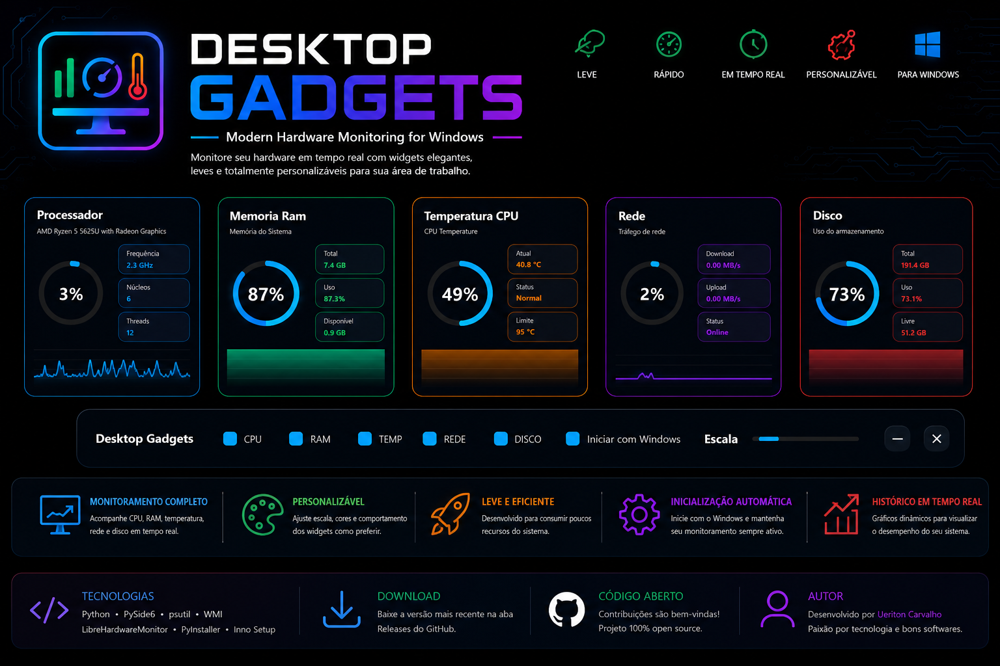

# 🖥️ Desktop Gadgets



Desktop Gadgets é um software moderno para monitoramento de hardware em tempo real utilizando widgets para Windows.

# 🖥️ Gadgets-Windows

Desktop Gadgets é um software desenvolvido em Python para monitoramento de hardware em tempo real através de widgets modernos para a área de trabalho do Windows.

---

## 📸 Captura de Tela


---

## ✨ Recursos

- 📊 Monitor de CPU
- 💾 Monitor de Memória RAM
- 🌡️ Temperatura do processador
- 💽 Utilização de Disco
- 🌐 Tráfego de Rede
- 📈 Histórico em tempo real
- 🎨 Interface moderna
- ⚙️ Configurações personalizadas
- 🚀 Inicialização automática com o Windows
- 🔍 Escala dos widgets

---

## 🛠 Tecnologias

- Python
- PySide6
- psutil
- WMI
- LibreHardwareMonitor
- PyInstaller
- Inno Setup

---

## 📂 Estrutura

```text
core/
widgets/
ui/
themes/
data/
LibreHardwareMonitor/
```

---

## 🚀 Executando

```bash
pip install -r requirements.txt
python main.py
```

---

## 📦 Compilação

```bash
pyinstaller DesktopGadgets.spec
```

---

## 📥 Download

As versões compiladas estarão disponíveis na aba **Releases**.

---

## 🗺️ Roadmap

- ✅ Widgets de Hardware
- ✅ Painel de Controle
- ✅ Inicialização com Windows
- ✅ Escala dos Widgets
- ⏳ Novos temas
- ⏳ Atualizador automático
- ⏳ Sistema de plugins

---

## 👨‍💻 Autor

Desenvolvido por **Ueriton Carvalho**.